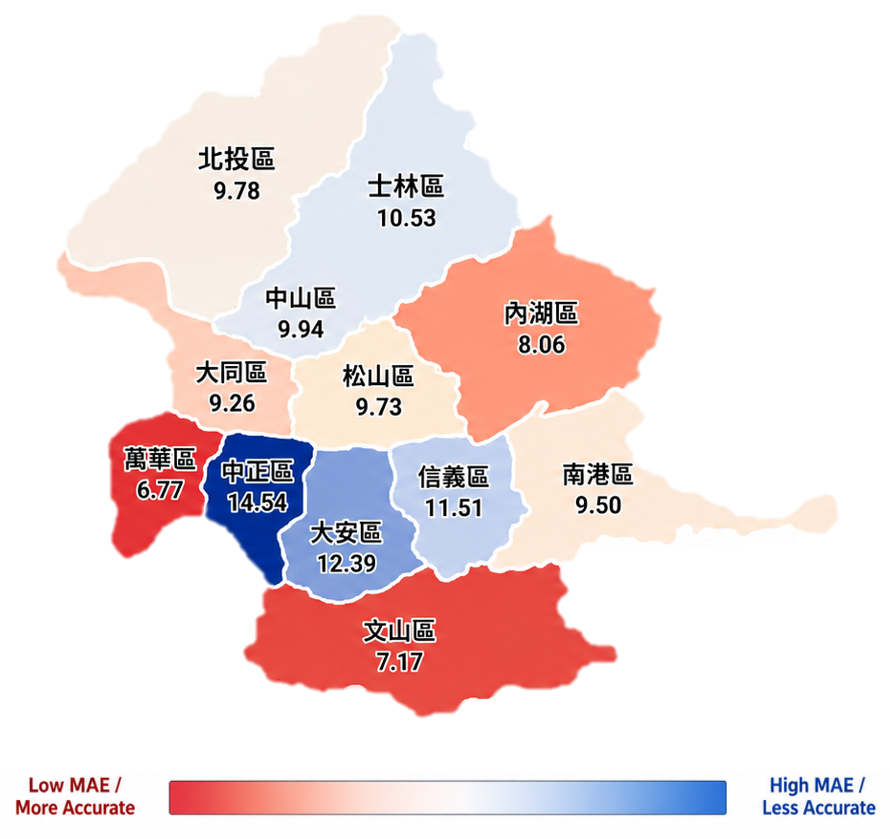

# Taipei House Price Modeling

以臺北市實價登錄資料為核心的住宅單價預測專案。目標是建立可回測、可解釋、能追蹤行政區誤差的房價模型，並用 rolling time split 避免把未來資訊帶進訓練流程。

<p align="center">
  
</p>

<p align="center">
  <b>V4 Tuned LightGBM district-level MAE</b><br>
  MAE 單位為萬元/坪；高單價行政區通常會有較高的絕對誤差。
</p>

## Highlights

- 資料來源：臺北市住宅實價登錄資料，建置後模型資料列數約 90,481 筆。
- 預測目標：`unit_price_ping`，也就是每坪單價。
- 驗證方式：15 組 rolling folds，test quarter 從 2022Q3 到 2026Q1。
- 主要模型：LightGBM regression pipeline，搭配 train-only preprocessing。
- 特色工程：時間感知行情、規則式 comparable sales、Qwen embedding + reranker comparable features。
- 泄漏控管：歷史行情與 comparable features 只使用 `trade_date < current trade_date` 的交易。

## Current Best Result

V4 使用 embedding/reranker comparable features 加上 LightGBM parameter search。最佳參數來自 rolling test-period mean MAE。

| model | folds | mean MAE | mean RMSE | mean MAPE | mean R2 |
| --- | ---: | ---: | ---: | ---: | ---: |
| V4 tuned LightGBM | 15 | 9.9228 | 13.3242 | 13.9441% | 0.7218 |
| V3 tree model | 15 | 10.2311 | 13.6624 | 14.3453% | 0.7075 |
| District + building-type median baseline | 15 | 15.2770 | 20.9384 | 18.7750% | 0.3122 |

最佳 V4 模型相較 district + building-type median baseline，mean MAE 約降低 35%。

## What Drives The Model

V4 feature importance 顯示，comparable sales 是主要訊號來源，其次是房屋本身條件與近期市場行情。

| feature group | gain share |
| --- | ---: |
| Comparable Sales | 88.26% |
| Housing Attributes | 8.10% |
| Recent Market Signals | 2.71% |
| Location and Time | 0.77% |
| Note / Quality Flags | 0.17% |

詳細圖表與 CSV 在 `reports/v4/lightgbm_search/feature_importance/`。

## Project Structure

```text
.
├── Script/                         # data build, feature engineering, training, tests
├── reports/                        # versioned experiment reports and exported tables
│   ├── v1/                         # base dataset, folds, baseline models
│   ├── v2/                         # time-aware market features
│   ├── v3/                         # rule-based comparable features
│   ├── v4/lightgbm_search/         # tuned LightGBM results and diagnostics
│   └── v5_embedding_only/          # embedding-only experiment outputs
├── analysis/phase3_explainability/ # SHAP, residual, correlation analysis
├── requirements.txt
└── MAE_TAIPEI.png
```

Large raw data, processed datasets, model artifacts, and embedding caches are intentionally excluded by `.gitignore`.

## Setup

```bash
python -m venv .venv
source .venv/bin/activate
pip install -r requirements.txt
```

For V4 embedding/reranker feature generation, download the Hugging Face models first:

```bash
huggingface-cli login
huggingface-cli download Qwen/Qwen3-Embedding-8B --local-dir models/hf/Qwen3-Embedding-8B
huggingface-cli download Qwen/Qwen3-Reranker-8B --local-dir models/hf/Qwen3-Reranker-8B
```

The full V4 command set is documented in `reports/v4/phase4_cli_commands.md`.

## Typical Workflow

```bash
# 1. Build cleaned Taipei transaction dataset
python Script/build_taipei_dataset.py --help

# 2. Build rolling time splits
python Script/build_time_splits.py --help

# 3. Add time-aware market features
python Script/add_time_aware_features_v2.py --help

# 4. Add rule-based comparable-sale features
python Script/add_comparable_features_v3.py --help

# 5. Add embedding/reranker comparable-sale features
python Script/add_embedding_reranker_comparable_features_v4.py --help

# 6. Run LightGBM parameter search
python Script/search_lightgbm_params.py --help
```

Use `--help` on each script to inspect paths and runtime options before running the full pipeline.

## Key Reports

- `reports/v4/lightgbm_search/lightgbm_param_search_summary.md`
- `reports/v4/lightgbm_search/台北行政區_MAE/taipei_district_mae_v4_lightgbm_search.md`
- `reports/v4/lightgbm_search/feature_importance/feature_importance_summary.md`
- `reports/v4/phase4_cli_commands.md`
- `reports/README.md`

## Tests

```bash
pytest Script/test_*.py
```

Some tests and scripts expect local processed data or model artifacts that are not committed to Git.
